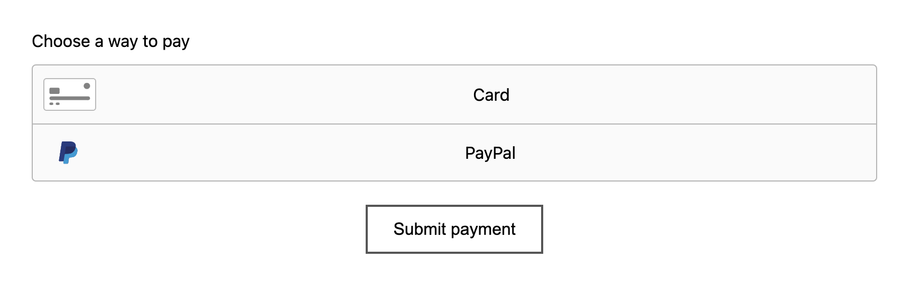
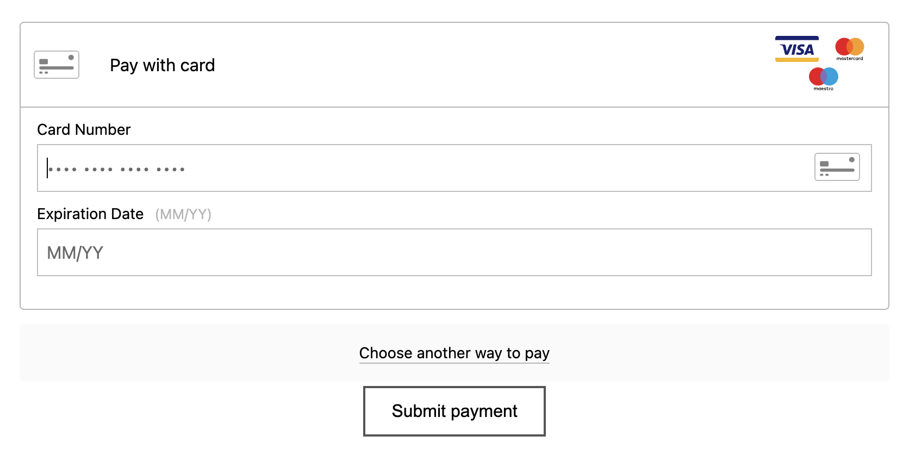
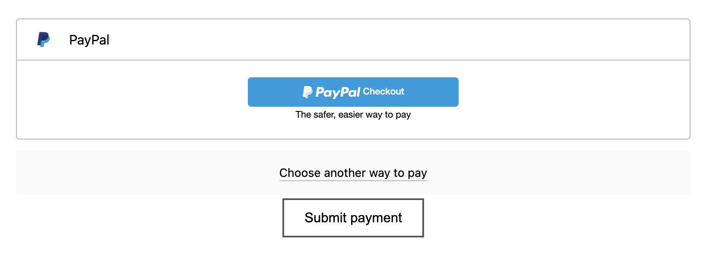

<h1 align="center">PayPal BrainTree Payment Drop-in User Interface</h1>

[View the live project here.](https://braintree-drop-in-ui-nodejs.herokuapp.com/)

[Official documentation.](https://developer.paypal.com/braintree/docs/start/tutorial-drop-in-node)

PayPal BrainTree Drop-in UI is a ready-made payment UI that offers the quickest way to integrate and start securely accepting payments with Braintree. In this repository, I wanted to show you how easy it would be to integrate this popular payment platform in your Node.js app. The documentation is very easy to follow, what you will find in this app is only the payment section and the chance to pay with a sandbox account (please see pictures below). You can add this example to your app, follow the documentation to learn how to create your SandBoc (test) account.

If you would like an example in Python instead, please check my repository that integrates BrainTree with Python [here.](https://github.com/Renato79/braintree-flask-python-integration)

<p align="center">
  
</p>

<p align="center">
  
</p>

<p align="center">
  
</p>

## Technologies Used

### Features included in this project/webapp:

- Braintree JavaScript SDK

- Choose to pay by Credit Card or by PayPal

- Enter a new test transaction (Process a Sandbox payment)

- Success confirmation page


### Languages Used
- [HTML5](https://en.wikipedia.org/wiki/HTML5)
- [CSS3](https://en.wikipedia.org/wiki/Cascading_Style_Sheets)
- [JavaScript](https://en.wikipedia.org/wiki/JavaScript)

### Frameworks and Libraries
- [Node.js](https://nodejs.org/en/docs/)
- [Braintree JavaScript SDK](https://developer.paypal.com/braintree/docs/start/tutorial-drop-in-node)

You will need to use your own Merchant ID, Public Key, Private Key to interact with your Sandbox BrainTree account. 
Go to [Sandbox](https://sandbox.braintreegateway.com/), click on Settings at the top right (the gear icon), click on API, your account's details are right there. Replace these details in routes/checkout.js 

## How to complete a test transaction in this webapp
- [Testing Credit Cards - Documentation](https://developer.paypal.com/braintree/docs/reference/general/testing): You can choose any credit card listed on the Testing webpage. Be aware that each test amount listed on the webpage will trigger the associated authorization response. Just choose a successful transaction to check the app.
- [PayPal Payment - Documentation](https://developer.paypal.com/developer/accounts): Follow the link on the left. If you choose to pay through PayPal, since you are testing, you would need to use personal test account name created with your developer account, that would be something like: sb-o16b11435112324@personal.example.com.


## How to Fork and Clone
### Forking the GitHub Repository

By forking the GitHub Repository we make a copy of the original repository on our GitHub account to view and/or make changes without affecting the original repository by using the following steps...

1. Log in to GitHub and locate the [GitHub Repository](https://github.com/Renato79/braintree-drop-in-ui-nodejs)
2. At the top of the Repository (not top of page) just above the "Settings" Button on the menu, locate the "Fork" Button.
3. You should now have a copy of the original repository in your GitHub account.

### Making a Local Clone

1. Log in to GitHub and locate the [GitHub Repository](https://github.com/Renato79/braintree-drop-in-ui-nodejs)
2. Under the repository name, click "Clone or download".
3. To clone the repository using HTTPS, under "Clone with HTTPS", copy the link.
4. Open Git Bash
5. Change the current working directory to the location where you want the cloned directory to be made.
6. Type `git clone`, and then paste the URL you copied in Step 3.

```
$ git clone https://github.com/Renato79/braintree-drop-in-ui-nodejs
```

7. Press Enter. Your local clone will be created.

```
$ git clone https://github.com/Renato79/braintree-drop-in-ui-nodejs
> Cloning into `CI-Clone`...
> remote: Counting objects: 10, done.
> remote: Compressing objects: 100% (8/8), done.
> remove: Total 10 (delta 1), reused 10 (delta 1)
> Unpacking objects: 100% (10/10), done.
```

Click [Here](https://help.github.com/en/github/creating-cloning-and-archiving-repositories/cloning-a-repository#cloning-a-repository-to-github-desktop) to retrieve pictures for some of the buttons and more detailed explanations of the above process.